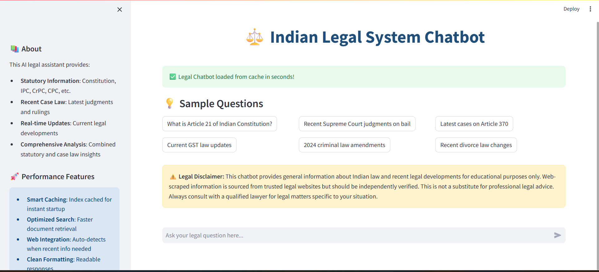
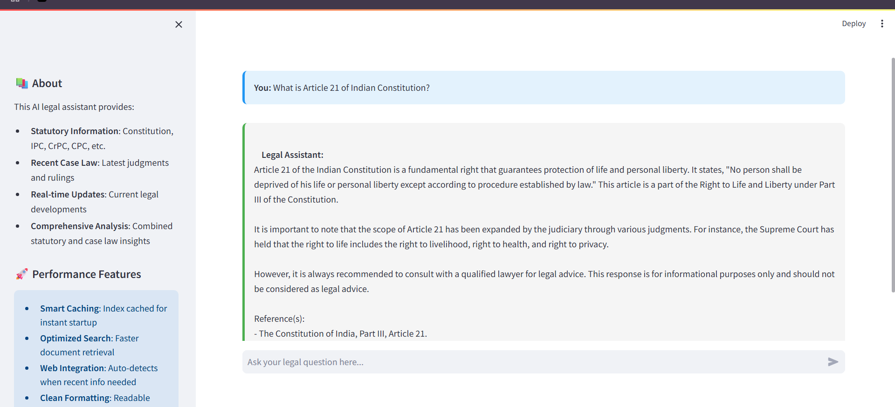

# ⚖️ Indian Legal System Chatbot

A Streamlit-powered AI chatbot that leverages **LlamaIndex**, **Mistral LLM**, and **vector-based retrieval** to answer queries related to Indian laws, constitutional provisions, and recent legal developments using both **statutory documents** and **real-time web context**.

## 🧠 Features

* 📚 **Statutory Search**: Supports Indian Constitution, IPC, CrPC, CPC, Evidence Act, etc.
* 🔍 **Web-enhanced RAG**: Blends recent case law via live search with RAG-based querying.
* ⚡ **Smart Index Caching**: Fast restarts using persisted vector indexes.
* 🧾 **Contextual Prompts**: Tailored prompt template guiding precise and lawful responses.
* 🖥️ **Streamlit UI**: Interactive frontend for users to query and view results in real-time.
* 📦 **Auto Document Detection**: Reads all `.pdf`, `.txt`, `.docx` files from `/documents/`.

## 💡 Sample Queries

* *"What is Article 21 of the Indian Constitution?"*
* *"Recent Supreme Court judgments on bail"*
* *"Latest cases on Article 370"*
* *"Current GST law updates"*

## 🖼️ Screenshots

## ⚠️ Legal Disclaimer

This chatbot is meant for **educational purposes only**. It provides general information about Indian law and recent developments. Always consult with a qualified lawyer for any legal decisions.

## 📬 Contact

Created by **Disha Mondal**
GitHub: [@disha-mondal-github](https://github.com/disha-mondal-github)

